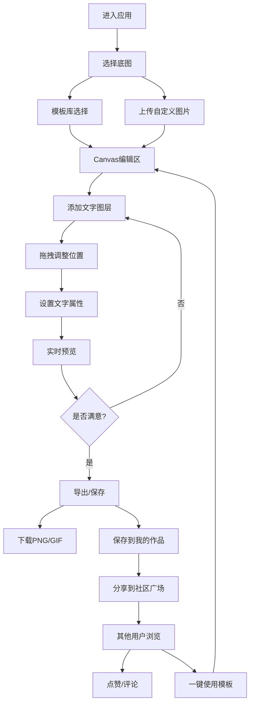

## 1. 产品概述

MemeCraft 是一款面向年轻用户群体的在线表情包制作平台，提供从模板选择、素材管理到社区分享的一站式表情包创作体验。用户可以快速创建个性化表情包，管理个人素材库，并与社区互动分享创意作品。

- **主要用途**：在线表情包制作、素材管理、社区分享互动
- **目标用户**：社交网络用户、内容创作者、喜欢表达个性的年轻群体
- **产品价值**：降低表情包创作门槛，激发创意分享，构建表情包创作者社区

## 2. 核心功能

### 2.1 用户角色

| 角色 | 注册方式 | 核心权限 |
|------|---------|----------|
| 普通用户 | 本地游客模式（无需注册） | 使用全部功能，数据保存在本地存储 |

### 2.2 功能模块

1. **首页/编辑器**：模板选择、图片上传、Canvas编辑器、文字图层管理、导出功能
2. **素材库管理**：我的素材列表、分类管理、素材上传、素材预览
3. **我的作品**：作品列表、作品预览、作品编辑、作品删除
4. **社区广场**：作品瀑布流展示、点赞互动、评论系统、一键使用模板

### 2.3 页面详情

| 页面名称 | 模块名称 | 功能描述 |
|---------|---------|---------|
| 编辑器首页 | 顶部导航 | 页面切换、用户标识、快捷操作 |
| 编辑器首页 | 模板选择区 | 热门表情包底图网格展示、分类筛选、点击选用 |
| 编辑器首页 | 图片上传区 | 拖拽上传、点击上传、上传预览 |
| 编辑器首页 | Canvas编辑区 | 实时渲染预览、图片缩放适配 |
| 编辑器首页 | 文字图层面板 | 文字列表、添加/删除、选中高亮、拖拽排序 |
| 编辑器首页 | 文字属性面板 | 内容编辑、字体选择、字号、颜色、描边、粗体、斜体、对齐 |
| 编辑器首页 | 导出操作栏 | PNG/GIF格式选择、导出下载、保存到作品 |
| 素材库管理 | 分类侧边栏 | 系统分类、用户自定义分类、添加分类、删除分类 |
| 素材库管理 | 素材网格 | 素材缩略图、预览弹窗、使用按钮、删除按钮 |
| 素材库管理 | 上传区域 | 分类选择、批量上传、上传进度 |
| 我的作品 | 作品网格 | 作品缩略图、创建时间、预览、编辑、删除、分享到社区 |
| 社区广场 | 瀑布流列表 | 用户公开作品、作者信息、点赞数、评论数 |
| 社区广场 | 作品详情弹窗 | 大图预览、作者信息、点赞按钮、评论列表、发表评论、一键使用 |
| 社区广场 | 筛选排序 | 最新/最热排序、分类筛选 |

## 3. 核心流程

### 3.1 表情包制作流程
用户从首页进入编辑器，可以选择热门模板或上传自定义图片作为底图。在Canvas编辑区通过添加文字图层，拖拽调整位置，设置字体属性（颜色、大小、描边、emoji），实时预览效果。完成后选择导出格式（PNG/GIF）下载，或保存到"我的作品"。

### 3.2 社区互动流程
用户可将作品设置为公开分享到社区广场。其他用户浏览社区时可以点赞、发表评论，也可以点击"一键使用"将该作品作为模板导入编辑器进行二次创作。

## 4. 用户界面设计

### 4.1 设计风格

**设计主题：Playful Neon - 俏皮霓虹风格**
- **主色调**：霓虹粉 `#FF2E9E`、电光蓝 `#00F0FF`、活力黄 `#FFEB3B`
- **辅助色**：深紫背景 `#0D0B1F`、卡片深紫 `#1A1635`、边框淡紫 `#2D2654`
- **按钮风格**：圆角胶囊按钮，渐变填充 + 霓虹发光效果，hover时发光增强
- **字体选择**：标题使用 `ZCOOL KuaiLe`（中文俏皮黑体），正文使用 `Noto Sans SC`
- **布局风格**：卡片式布局，玻璃拟态效果（backdrop-filter: blur），不规则圆角
- **图标风格**：emoji + 线性霓虹描边图标，活泼趣味

### 4.2 页面设计概述

| 页面名称 | 模块名称 | UI元素 |
|---------|---------|--------|
| 编辑器首页 | 整体布局 | 左右分栏：左侧工具面板（320px）+ 中央Canvas区 + 右侧属性面板（300px） |
| 编辑器首页 | 模板选择区 | 横向滚动卡片，hover时霓虹边框动画，选中态发光边框 |
| 编辑器首页 | Canvas区 | 深色棋盘格透明背景，画布阴影，周围渐变光晕装饰 |
| 编辑器首页 | 文字列表 | 卡片堆叠效果，拖拽时浮动动画，删除按钮霓虹红 |
| 编辑器首页 | 属性面板 | 分组折叠卡片，颜色选择器带渐变色板，滑块带霓虹轨道 |
| 编辑器首页 | 导出栏 | 底部悬浮操作栏，主按钮脉冲动画 |
| 素材库/我的作品 | 网格布局 | 瀑布流卡片，图片hover放大效果，遮罩操作按钮渐显 |
| 社区广场 | 瀑布流 | 交错布局，作品卡片带作者头像气泡，点赞心形弹跳动画 |
| 全局 | 导航栏 | 顶部渐变玻璃条，激活页签霓虹下划线，页面切换淡入动画 |

### 4.3 响应式设计

- **桌面端优先**：≥1280px 三栏布局，充分利用空间
- **平板适配**：768px-1279px 左右面板可折叠收起，Canvas占主要空间
- **移动端**：<768px 面板改为底部抽屉式，Canvas全屏显示，触控拖拽优化
- **触控优化**：增大触摸热区（≥44px），双指缩放支持，长按触发菜单

### 4.4 动效亮点

- 页面加载：元素依次淡入上移（stagger 80ms）
- Canvas文字拖拽：位置变化缓动（cubic-bezier: 0.34, 1.56, 0.64, 1）
- 点赞按钮：心形缩放弹跳（scale 0→1.3→1）+ 粒子爆炸
- 模板卡片：hover时 translateY(-4px) + box-shadow扩散
- 模态弹窗：backdrop模糊渐入 + 内容缩放弹入
