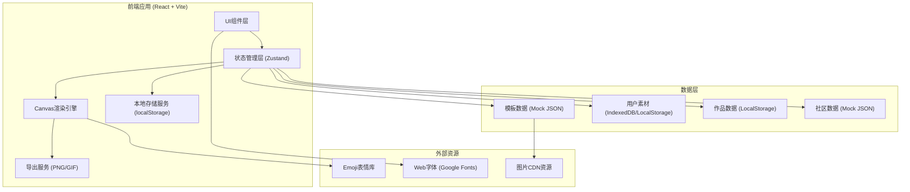

## 1. 架构设计



## 2. 技术描述

- **前端框架**：React@18.2.0 + TypeScript
- **构建工具**：Vite@5.0.0
- **样式方案**：TailwindCSS@3.4.0 + 自定义CSS变量
- **状态管理**：Zustand@4.4.0（轻量级状态管理）
- **路由管理**：React Router DOM@6.20.0
- **图标库**：Lucide React + Emoji Unicode
- **Canvas工具**：原生 Canvas API + html2canvas（备用导出方案）
- **GIF导出**：gif.js（GIF编码库）
- **数据持久化**：localStorage（主）+ IndexedDB（大文件素材）
- **后端服务**：无（纯前端应用，数据本地存储，社区数据Mock）

## 3. 路由定义

| 路由 | 页面组件 | 用途 |
|------|---------|------|
| `/` | `EditorPage` | 首页-表情包编辑器 |
| `/library` | `LibraryPage` | 素材库管理 |
| `/works` | `WorksPage` | 我的作品 |
| `/community` | `CommunityPage` | 社区广场 |

## 4. 数据模型定义

### 4.1 核心数据类型

```typescript
// 文字图层
interface TextLayer {
  id: string;
  content: string;
  x: number;
  y: number;
  fontSize: number;
  fontFamily: string;
  color: string;
  strokeColor: string;
  strokeWidth: number;
  bold: boolean;
  italic: boolean;
  align: 'left' | 'center' | 'right';
  rotation: number;
  opacity: number;
  zIndex: number;
}

// 底图/素材
interface MaterialImage {
  id: string;
  url: string;
  name: string;
  category: string;
  width: number;
  height: number;
  createdAt: number;
  isSystem: boolean;
}

// 表情包作品
interface MemeWork {
  id: string;
  title: string;
  baseImage: string;
  baseImageWidth: number;
  baseImageHeight: number;
  layers: TextLayer[];
  thumbnail: string;
  createdAt: number;
  updatedAt: number;
  isPublic: boolean;
  likes: number;
  comments: Comment[];
  author: UserInfo;
}

// 素材分类
interface Category {
  id: string;
  name: string;
  emoji: string;
  isSystem: boolean;
}

// 评论
interface Comment {
  id: string;
  content: string;
  authorName: string;
  authorAvatar: string;
  createdAt: number;
  likes: number;
}

// 用户信息
interface UserInfo {
  id: string;
  nickname: string;
  avatar: string;
}

// 编辑器状态
interface EditorState {
  baseImage: string | null;
  baseImageWidth: number;
  baseImageHeight: number;
  layers: TextLayer[];
  selectedLayerId: string | null;
  canvasScale: number;
  canvasOffsetX: number;
  canvasOffsetY: number;
}
```

### 4.2 本地存储键定义

| 存储键 | 数据类型 | 说明 |
|--------|---------|------|
| `memecraft:user` | `UserInfo` | 当前用户信息 |
| `memecraft:materials` | `MaterialImage[]` | 用户上传的素材库 |
| `memecraft:categories` | `Category[]` | 用户自定义分类 |
| `memecraft:works` | `MemeWork[]` | 用户保存的作品 |
| `memecraft:community` | `MemeWork[]` | 社区公开作品（含mock初始数据） |
| `memecraft:liked` | `string[]` | 用户点赞的作品ID列表 |

## 5. 文件结构设计

```
src/
├── assets/              # 静态资源
│   ├── images/          # 模板图片
│   └── fonts/           # 字体文件
├── components/          # 可复用组件
│   ├── editor/          # 编辑器相关组件
│   │   ├── Canvas.tsx
│   │   ├── LayerPanel.tsx
│   │   ├── PropertyPanel.tsx
│   │   ├── TemplateSelector.tsx
│   │   └── ImageUploader.tsx
│   ├── common/          # 通用组件
│   │   ├── Navbar.tsx
│   │   ├── Modal.tsx
│   │   ├── Button.tsx
│   │   ├── ColorPicker.tsx
│   │   └── EmojiPicker.tsx
│   ├── library/         # 素材库组件
│   ├── works/           # 作品组件
│   └── community/       # 社区组件
├── pages/               # 页面组件
│   ├── EditorPage.tsx
│   ├── LibraryPage.tsx
│   ├── WorksPage.tsx
│   └── CommunityPage.tsx
├── store/               # Zustand状态管理
│   ├── editorStore.ts
│   ├── materialStore.ts
│   ├── worksStore.ts
│   └── communityStore.ts
├── utils/               # 工具函数
│   ├── canvas.ts        # Canvas渲染工具
│   ├── export.ts        # 导出工具（PNG/GIF）
│   ├── storage.ts       # 本地存储工具
│   └── mockData.ts      # Mock数据生成
├── types/               # TypeScript类型定义
│   └── index.ts
├── styles/              # 全局样式
│   ├── globals.css
│   └── animations.css
├── App.tsx
├── main.tsx
└── router.tsx
```

## 6. 核心技术实现要点

### 6.1 Canvas渲染引擎
- 使用双缓冲Canvas：离屏Canvas处理绘制，展示Canvas负责显示
- 文字绘制支持多行自动换行（计算文字宽度）
- 描边效果：先绘制描边文字（大字号+描边色），再绘制填充文字
- Emoji支持：使用系统emoji字体，直接Unicode渲染
- 拖拽交互：鼠标坐标→Canvas坐标转换（考虑scale和offset）
- 吸附辅助：可选项，拖拽时显示参考线

### 6.2 GIF导出方案
- 使用gif.js库进行客户端GIF编码
- 如果用户未上传GIF底图，单帧导出时默认转PNG（GIF体积更小但有损）
- 支持质量参数设置（1-30）

### 6.3 性能优化
- 绘制防抖：属性修改时使用requestAnimationFrame批量重绘
- 图片缓存：已加载的Image对象缓存到Map
- 虚拟滚动：素材库/社区列表使用react-window懒加载
- Throttle：拖拽移动事件节流

### 6.4 Mock初始数据
- 预设15-20张热门表情包模板（使用免费meme图片URL或base64）
- 预设30-50条社区作品示例（含文字图层数据）
- 预设用户数据：随机生成用户名和头像
